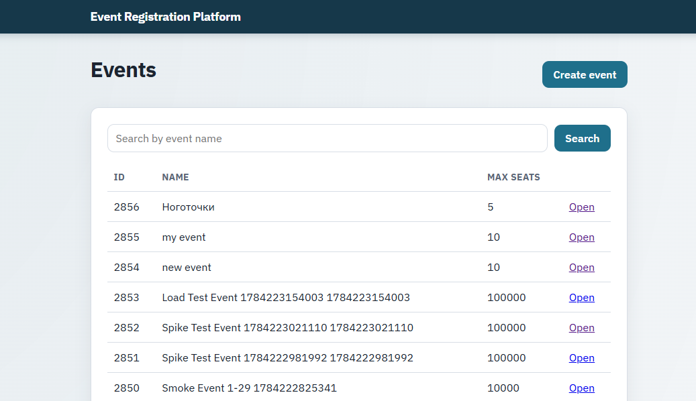
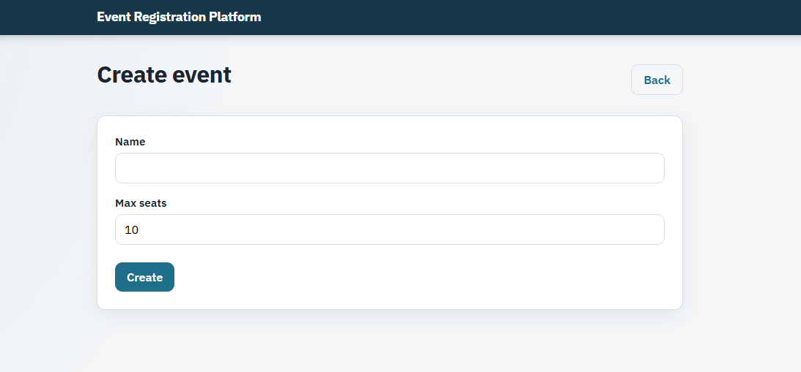
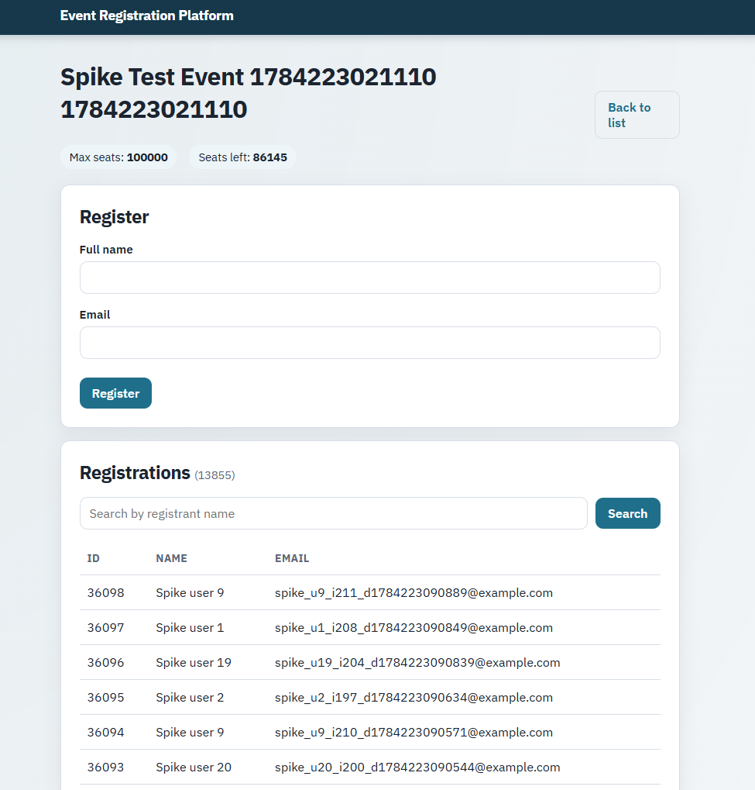

## Event Registration Platform

## About
Event Registration API — pet project.
Covers:
- REST API (Spring Boot, Java 21, Flyway)
- Automated API tests in **Java (REST Assured)** and **Python (pytest + httpx)**
- CI on **GitHub Actions** (Java unit/API tests + Python black-box tests)
- Performance tests with **k6** (smoke / load / spike)
- Dockerized **PostgreSQL** for local prod-like runs

## Web UI (Thymeleaf)

Open after `bootRun`: http://localhost:8080/

| Page | URL | Features |
|------|-----|----------|
| Events list | `/` | search by name, pagination (100/page) |
| Create event | `/events/new` | validation errors, redirect to created event |
| Event details | `/events/{id}` | seats left, register form, registrations list with search + pagination |

UI uses the same services as REST API (SSR forms, not JSON).

## Domain rules

- Unique event name
- Unique email per event
- Cannot register when seats are full (409)
- Concurrent registration protected (row lock / race handling)
- Remaining seats shown on event details page

## Tech stack
| Area | Tools |
|------|--------|
| Backend | Java 21, Spring Boot, JPA, Flyway, H2 / PostgreSQL |
| API docs | springdoc OpenAPI (Swagger UI) |
| Java tests | JUnit 5, REST Assured, MockMvc |
| Python tests | pytest, httpx |
| Performance | k6 |
| CI/CD | GitHub Actions |
| Infra | Docker Compose |

## Structure
- `app/` — Spring Boot API (Java 21) + Thymeleaf UI
- `tests-api/` — Python REST tests (pytest + httpx)
- `tests-e2e/` — Playwright E2E (planned)
- `perf/k6/` — k6 load tests (smoke / load / spike)

## Quick start
```bash
# App (H2)
cd app && ./gradlew bootRun
# Web UI
open http://localhost:8080/
# Java tests
cd app && ./gradlew test
# Python API tests (app must be running)
cd tests-api && pytest
# k6 smoke
k6 run perf/k6/smoke.js

Swagger: http://localhost:8080/swagger-ui.html  
Health: http://localhost:8080/actuator/health
```

## API (REST)
| Method | Path | Notes |
|--------|------|-------|
| POST | `/api/events` | create |
| GET | `/api/events` | list / filter |
| GET | `/api/events/{id}` | by id |
| PATCH | `/api/events/{id}` | update |
| DELETE | `/api/events/{id}` | delete |
| POST | `/api/events/{id}/registrations` | register (201 / 409) |
Swagger: http://localhost:8080/swagger-ui.html

## CI
Tests run automatically on push/PR via GitHub Actions.

| Workflow | What it runs |
|----------|----------------|
| App CI | `./gradlew test` (Java / REST Assured) |
| Python API Tests | build jar → start app → `pytest` |

Badges at the top show current status.

## Run with PostgreSQL (Docker)

```bash
# 1. Start database
cd app
docker compose up -d

# 2. Run app with docker profile
cd app
./gradlew bootRun --args='--spring.profiles.active=docker'
```

Stop database:
```bash
docker compose down
```

## Run tests (H2, no Docker required)
```bash
cd app
./gradlew test
```

## Performance (k6)

### Prerequisites
1. Start the app (`cd app && ./gradlew bootRun`)
2. Install [k6](https://grafana.com/docs/k6/latest/set-up/install-k6/)

### Smoke
```bash
k6 run perf/k6/smoke.js
```

### Load (registrations)
```bash
k6 run perf/k6/load-register.js
```

### Spike
```bash
k6 run perf/k6/spike.js
```

### Results (local)

| Test  | VUs / stages | Duration | p95     | Failed | Checks |
|-------|-------------|-------|---------|--------|--------|
| Smoke | 2 VU        | 30s   | 17.33ms | 0 %    | 100 %  |
| Load  | 0→50→0      | ~3m   | 160.64ms | 0 %    | 100 %  |
| Spike | 10→100→0    | ~1m   | 626.22ms | 0 %    | 100 %  |

## Python API tests

```bash
# 1. Start the app
cd app && ./gradlew bootRun

# 2. In another terminal
cd tests-api
python -m venv .venv
# Windows:
.venv\Scripts\activate
pip install -r requirements.txt
pytest
```




