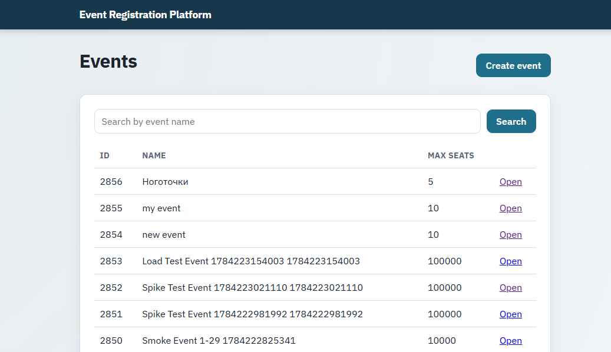
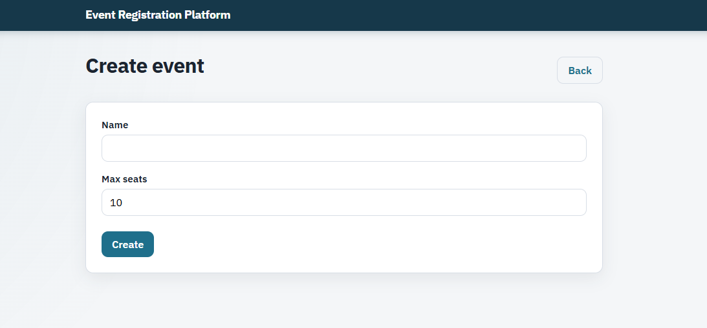
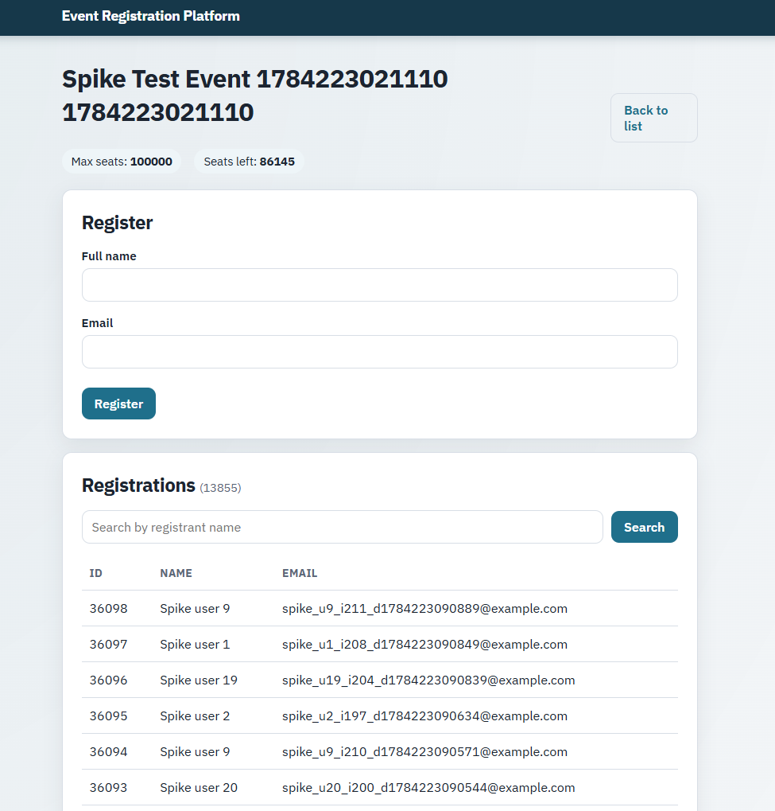

## Event Registration Platform

## About
Event Registration API — pet project.
Covers:
- REST API (Spring Boot, Java 21, Flyway)
- Automated API tests in **Java (REST Assured)** and **Python (pytest + httpx)**
- E2E UI tests with **Playwright (Java + Python)**
- CI on **GitHub Actions** (Java tests, Python API tests, Playwright E2E)
- Performance tests with **k6** (smoke / load / spike)
- Dockerized **PostgreSQL** for local prod-like runs

## Web UI (Thymeleaf)

Open after `bootRun`: http://localhost:8080/

| Page | URL | Features |
|------|-----|----------|
| Events list | `/` | search by name, pagination (100/page) |
| Login | `/login` | JWT via `/api/auth/login`, token in `localStorage` |
| Register | `/register` | full name + email + password → USER + JWT |
| Admin Panel | `/adminPanel` | ADMIN only; Users tab to set USER / SUPER_USER |
| Create event | `/events/new` | ADMIN / SUPER_USER only; calls `POST /api/events` |
| Event details | `/events/{id}` | guests browse; logged-in users register from profile (no name/email form) |

Create event uses the secured REST API from the browser (`Authorization: Bearer ...`). Event registration requires login; name/email come from the user account.

## Auth
Default admin (seeded on startup):
email:    admin@example.com
password: admin123

Roles:
- `ADMIN` — seeded account (and any admins added via `AdminUserInitializer` / DB)
- `SUPER_USER` — can create events and register for events
- `USER` — can register for events only

POST /api/auth/register  → USER + accessToken (requires fullName)
POST /api/auth/login     → accessToken

Header: Authorization: Bearer <accessToken>

Swagger: Authorize → bearerAuth → insert token

## Domain rules

- Unique event name
- Unique email per event
- Cannot register when seats are full (409)
- Concurrent registration protected (row lock / race handling)
- Remaining seats shown on event details page

## Tech stack
| Area | Tools                                                   |
|------|---------------------------------------------------------|
| Backend | Java 21, Spring Boot, JPA, Flyway, H2 / PostgreSQL, JWT |
| API docs | springdoc OpenAPI (Swagger UI)                          |
| Java tests | JUnit 5, REST Assured, MockMvc, Allure                  |
| Python API tests | pytest, httpx, Allure                                   |
| E2E | Playwright (Java + Python), Allure                      |
| Performance | k6 (+ HTML/JSON summary)                                |
| CI/CD | GitHub Actions                                          |
| Infra | Docker Compose                                          |

## Structure
- `app/` — Spring Boot API (Java 21) + Thymeleaf UI
- `tests-api/` — Python REST tests (pytest + httpx)
- `tests-e2e/java/` — Playwright E2E (Java)
- `tests-e2e/python/` — Playwright E2E (Python)
- `perf/k6/` — k6 load tests (smoke / load / spike)

## Quick start
```bash
# App (H2)
cd app && ./gradlew bootRun
# Web UI
open http://localhost:8080/
# Java tests
cd app && ./gradlew test
# Python API tests (app must be running)
cd tests-api && pytest
# k6 smoke
k6 run perf/k6/smoke.js
# Playwright E2E (app must be running)
cd tests-e2e/java && ./gradlew installPlaywright && ./gradlew test
# Playwright E2E Python (app must be running)
cd tests-e2e/python
# activate venv (py .\.venv\Scripts\activate), then:
pytest

Swagger: http://localhost:8080/swagger-ui.html  
Health: http://localhost:8080/actuator/health
```

## API (REST)
| Method | Path | Notes | Access |
|--------|------|-------|--------|
| POST | `/api/events` | create | Admin |
| GET | `/api/events` | list / filter | Public |
| GET | `/api/events/{id}` | by id | Public |
| PATCH | `/api/events/{id}` | update | Admin |
| DELETE | `/api/events/{id}` | delete | Admin |
| POST | `/api/events/{id}/registrations` | register current user (201 / 409) | Authenticated |
| DELETE | `/api/events/{id}/registrations/{registrationId}` | delete registration | Admin: any; Super User: on own events; User: own |
| DELETE | `/api/events/{id}` | delete event | Admin: any; Super User: own events |
Swagger: http://localhost:8080/swagger-ui.html

## CI
Tests run automatically on push/PR via GitHub Actions.
## CI workflows

| Workflow | Runs |
|----------|------|
| App CI | `./gradlew test` |
| Python API Tests | bootJar → start app → pytest |
| E2E Java | Playwright Java |
| E2E Python | Playwright Python |

Badges at the top show current status.

## Run with PostgreSQL (Docker)

```bash
# 1. Start database
cd app
docker compose up -d

# 2. Run app with docker profile
cd app
./gradlew bootRun --args='--spring.profiles.active=docker'
```

Stop database:
```bash
docker compose down
```

Clean database (drop + recreate):
```bash
docker compose down -v
docker compose up -d
```

## Run tests (H2, no Docker required)
```bash
cd app
./gradlew test
```

## Performance (k6)

### Prerequisites
1. Start the app (`cd app && ./gradlew bootRun`)
2. Install [k6](https://grafana.com/docs/k6/latest/set-up/install-k6/)

Run from the **repo root** (paths in `handleSummary` are relative to cwd):

### Smoke
```bash
k6 run perf/k6/smoke.js
```

### Load (registrations)
```bash
k6 run perf/k6/load-register.js
```

### Spike
```bash
k6 run perf/k6/spike.js
```

After a run, open (files are named per scenario and do not overwrite each other):
- `perf/k6/results/smoke-report.html` / `smoke-summary.json`
- `perf/k6/results/load-report.html` / `load-summary.json`
- `perf/k6/results/spike-report.html` / `spike-summary.json`

### Results (local)

| Test  | VUs / stages | Duration | p95      | Failed | Checks |
|-------|-------------|-------|----------|--------|--------|
| Smoke | 2 VU        | 30s   | 43.59ms  | 0 %    | 100 %  |
| Load  | 0→50→0      | ~3m   | 222.16ms | 0 %    | 100 %  |
| Spike | 10→100→0    | ~1m   | 664.22ms | 0 %    | 100 %  |

## Allure reports

Install the [Allure CLI](https://allurereport.org/docs/install/), run tests, then serve results:

```bash
# Java API (from app/)
./gradlew test
allure serve build/allure-results

# Java E2E (from tests-e2e/java/)
./gradlew test
allure serve build/allure-results

# Python API (from tests-api/)
pytest
allure serve allure-results

# Python E2E (from tests-e2e/python/)
pytest
allure serve allure-results
```

### GitHub Actions artifacts + GitHub Pages

| Suite | Pages URL pattern |
|-------|-------------------|
| App CI | `…/allure/app/<run_number>/` |
| Python API | `…/allure/python-api/<run_number>/` |
| E2E Java | `…/allure/e2e-java/<run_number>/` |
| E2E Python | `…/allure/e2e-python/<run_number>/` |
| k6 | `…/k6/<scenario>/<run_number>/<scenario>-report.html` |

Example: `https://<owner>.github.io/<repo>/allure/app/42/`

PR builds from the **same repo** also publish to Pages. Fork PRs keep artifacts only (token limits).

**One-time setup:** Repo → Settings → Pages → Source = Deploy from branch → `gh-pages`.

k6 **smoke** runs on push/PR when `app/**` or `perf/k6/**` change.  
Load/spike: Actions → **k6 Performance** → Run workflow → choose scenario.

## Python API tests

```bash
# 1. Start the app
cd app && ./gradlew bootRun

# 2. In another terminal
cd tests-api
python -m venv .venv
# Windows:
.venv\Scripts\activate
pip install -r requirements.txt
pytest
```

## Playwright E2E (Java)

App must be running on `:8080`.

```bash
# 1. Start the app
cd app && ./gradlew bootRun

# 2. Install browser (once)
cd tests-e2e/java
./gradlew installPlaywright

# 3. Run E2E
./gradlew test
# optional:
./gradlew test -DbaseUrl=http://localhost:8080
```

## Playwright E2E (Python)

Use **Python 3.12** (3.14 may fail installing `greenlet` wheels on Windows).

```bash
# 1. Start app
cd app && ./gradlew bootRun

# 2. Setup (first time)
cd tests-e2e/python
py -3.12 -m venv .venv
# Windows:
.venv\Scripts\activate
pip install -r requirements.txt
playwright install chromium

# 3. Run
pytest
# headed:
pytest --headed
```




