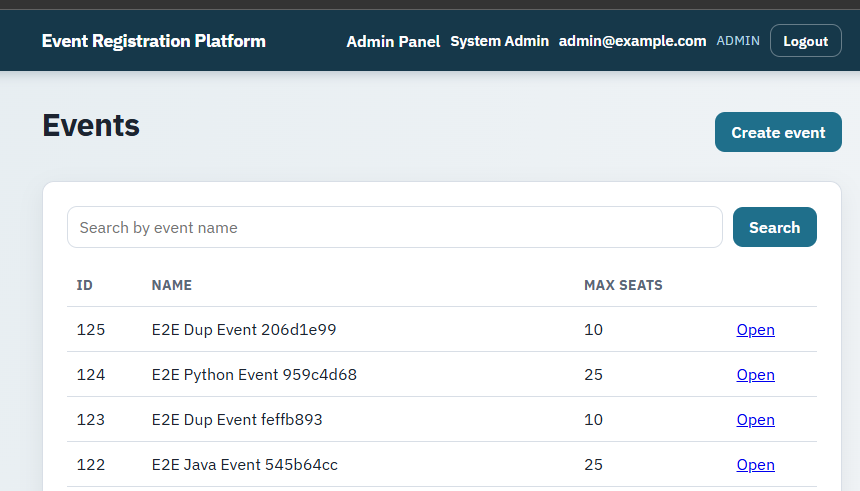
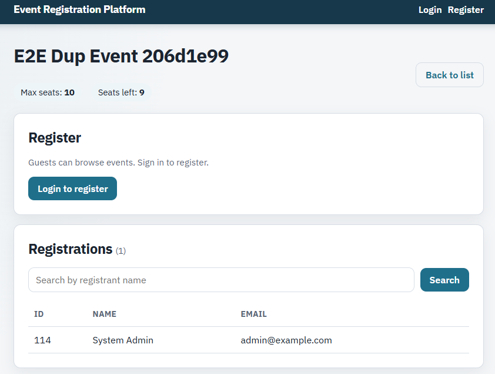
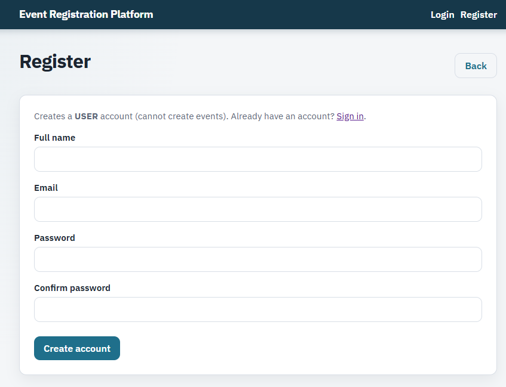
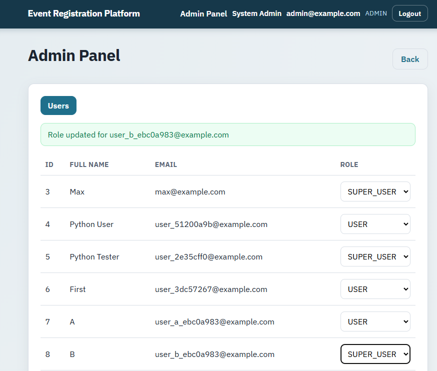
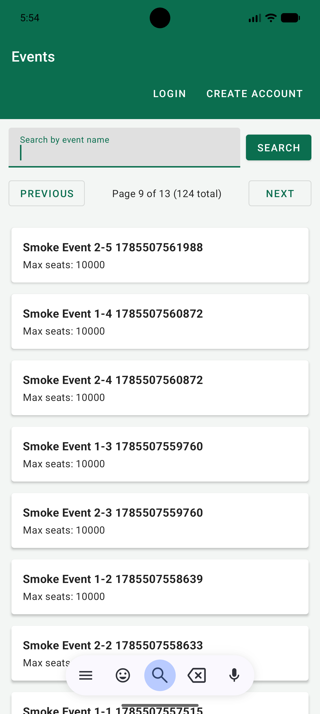
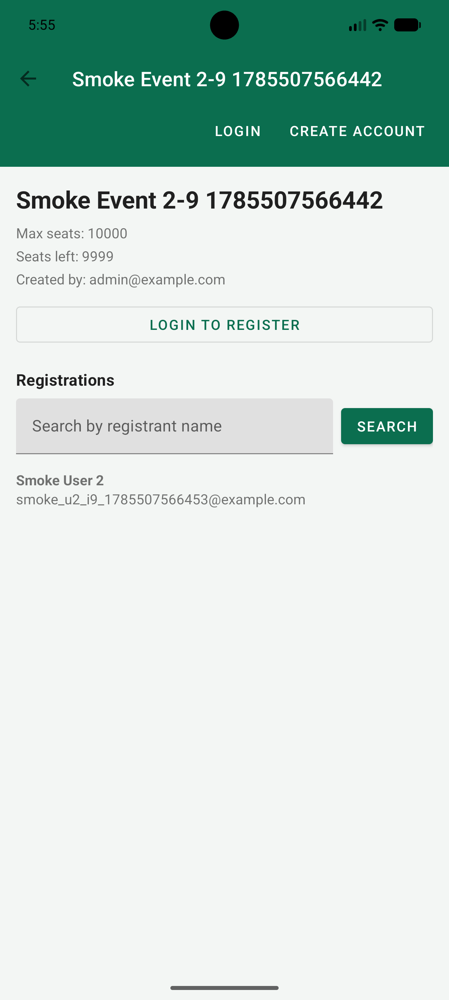
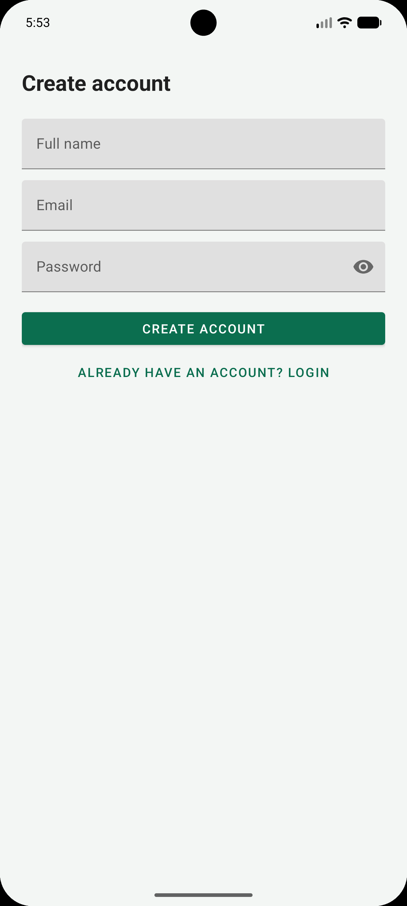
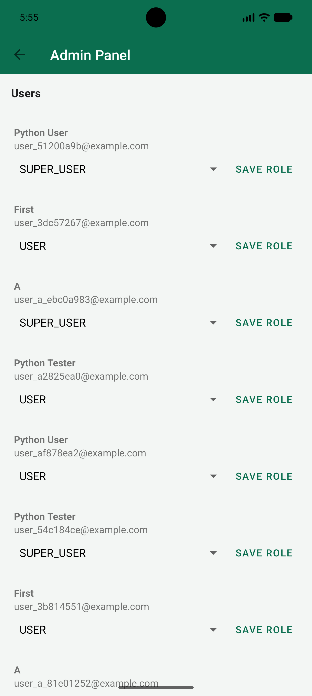

# Event Registration Platform

[](https://github.com/fettqa/event-registration-platform/actions/workflows/app-ci.yml)
[](https://github.com/fettqa/event-registration-platform/actions/workflows/python-api-tests.yml)
[](https://github.com/fettqa/event-registration-platform/actions/workflows/e2e-java.yml)
[](https://github.com/fettqa/event-registration-platform/actions/workflows/e2e-python.yml)

Demo: https://event-registration-jesq.onrender.com/

Pet project: Spring Boot event registration API with a Thymeleaf UI, multi-language test suites, k6, Android client, and GitHub Actions CI.

## About

- REST API — Java 21, Spring Boot, Flyway, JWT
- API tests — Java (REST Assured) and Python (pytest + httpx)
- E2E — Playwright (Java + Python)
- Load — k6 (smoke / load / spike)
- Mobile — Android Kotlin client + Maestro / Appium
- Local Postgres + Kafka via Docker Compose; deploy on Render

## Structure

| Path | What |
|------|------|
| `app/` | Spring Boot API + Thymeleaf UI |
| `tests-api/` | Python REST tests |
| `tests-e2e/java/` | Playwright E2E (desktop + `mobileChromeTest`) |
| `tests-e2e/python/` | Playwright E2E (desktop + `mobile_chrome/` smoke) |
| `perf/k6/` | k6 scripts |
| `android/` | Android client — [android/README.md](android/README.md) |
| `tests-mobile/` | Maestro / Appium — [tests-mobile/README.md](tests-mobile/README.md) |
| `k8s/` | kind lab manifests |

## Quick start

```bash
cd app && ./gradlew bootRun
# UI: http://localhost:8080/
# Swagger: http://localhost:8080/swagger-ui.html
# Health: http://localhost:8080/actuator/health

cd app && ./gradlew test

# Kafka (+ optional Mailpit inbox at :8025)
docker compose up -d kafka mailpit
./gradlew bootRun --args='--spring.profiles.active=kafka,mail'

# Postgres + Kafka
./gradlew bootRun --args='--spring.profiles.active=docker,kafka'

cd tests-api && pytest
k6 run perf/k6/smoke.js

cd tests-e2e/java && ./gradlew installPlaywright && ./gradlew test
# Mobile Chrome (web): ./gradlew mobileChromeTest

cd tests-e2e/python   # py -3.12 venv, pip install, playwright install chromium
pytest
pytest mobile_chrome -m smoke
```

Android / Appium / Maestro: see [android/README.md](android/README.md) and [tests-mobile/README.md](tests-mobile/README.md).

## Web UI

| Page | URL | Notes |
|------|-----|-------|
| Events | `/` | search, pagination (100/page) |
| Login | `/login` | JWT → `localStorage` |
| Register | `/register` | creates USER + JWT |
| Admin Panel | `/adminPanel` | ADMIN; set USER / SUPER_USER |
| Create event | `/events/new` | ADMIN / SUPER_USER |
| Event details | `/events/{id}` | register when logged in |

## Auth

Seeded admin: `admin@example.com` / `admin123`

| Role | Capabilities |
|------|----------------|
| `ADMIN` | seeded / DB; full admin |
| `SUPER_USER` | create events, register |
| `USER` | register for events |

```text
POST /api/auth/register  → USER + accessToken (fullName required)
POST /api/auth/login     → accessToken
Header: Authorization: Bearer {token}
```

Swagger: Authorize → bearerAuth → paste token.

## Domain rules

- Unique event name; unique email per event
- Full seats → 409; concurrent register protected (row lock)
- Profile `kafka`: `registration.created`; with `mail` → confirmation via Mailpit SMTP

## Tech stack

| Area | Tools |
|------|-------|
| Backend | Java 21, Spring Boot, JPA, Flyway, H2 / PostgreSQL, JWT, Spring Kafka |
| API docs | springdoc OpenAPI |
| Java tests | JUnit 5, REST Assured, MockMvc, Allure, EmbeddedKafka |
| Python API | pytest, httpx, Allure, kafka-python |
| E2E | Playwright (Java + Python), Allure |
| Performance | k6 |
| CI/CD | GitHub Actions |
| Deploy | Render (Docker Blueprint) |
| Infra | Docker Compose (Postgres + Kafka) |

## Android

Client details: [android/README.md](android/README.md). Guest Events list, auth header, create event, registrations, role-based delete, Admin Panel, search.

| Target | `BASE_URL` in `android/app/build.gradle.kts` |
|--------|-----------------------------------------------|
| Local + emulator | `http://127.0.0.1:8080/` + `adb reverse tcp:8080 tcp:8080` |
| Render | `https://event-registration-jesq.onrender.com/` (no reverse) |

Mobile UI E2E: [tests-mobile/README.md](tests-mobile/README.md).

## API (REST)

| Method | Path | Notes | Access |
|--------|------|-------|--------|
| POST | `/api/events` | create | Admin |
| GET | `/api/events` | list; `?page=&size=&q=` paged search | Public |
| GET | `/api/events/{id}` | by id | Public |
| PATCH | `/api/events/{id}` | update | Admin |
| DELETE | `/api/events/{id}` | delete | Admin any; Super User own |
| POST | `/api/events/{id}/registrations` | register (201 / 409) | Authenticated |
| GET | `/api/events/{id}/registrations` | list; optional `?page=&size=&q=` | Public |
| DELETE | `/api/events/{id}/registrations/{registrationId}` | delete registration | Admin any; Super User on own events; User own |

Swagger: http://localhost:8080/swagger-ui.html

## CI

| Workflow | Runs |
|----------|------|
| App CI | `./gradlew test` |
| Python API Tests | bootJar → app → pytest |
| E2E Java / Python | Playwright |
| Mobile Maestro / Appium | see `tests-mobile/README.md` |
| k6 | smoke on path changes; load/spike manual |

## Deploy (Render)

Free web service sleeps after ~15 min idle (cold start ~1 min). Free Postgres expires after 30 days.

### Blueprint

1. Ensure `Dockerfile`, `render.yaml`, `application-render.yml` are on `main`
2. [Render Dashboard](https://dashboard.render.com) → New → Blueprint
3. Connect `fettqa/event-registration-platform`, apply `render.yaml`
4. Open the HTTPS URL when build finishes

Admin: `admin@example.com` / `admin123`

### Manual

1. Create PostgreSQL (Free) → note connection fields
2. Web Service → Docker, repo root
3. Env: `SPRING_PROFILES_ACTIVE=render`, `DB_*`, `APP_JWT_SECRET` (≥32 chars)
4. Health check: `/actuator/health`

```bash
docker build -t event-registration .
```

## PostgreSQL (Docker)

```bash
cd app
docker compose up -d
./gradlew bootRun --args='--spring.profiles.active=docker'

docker compose down          # stop
docker compose down -v       # wipe data
```

## Kafka + Mailpit

Mailpit is local mock SMTP + inbox (not real email).

```bash
cd app
docker compose up -d kafka mailpit
./gradlew bootRun --args='--spring.profiles.active=kafka,mail'
```

Register for an event, then open http://localhost:8025. SMTP: `localhost:1025` (`application-mail.yml`).

Without `mail`, Kafka still runs; the listener only logs.

Java: `RegistrationMailKafkaApiTest` (GreenMail, in `./gradlew test`). Python/E2E mail marks need `kafka,mail` + Mailpit locally.

## Tests (app, H2)

```bash
cd app && ./gradlew test
```

## Performance (k6)

App must be up. Install [k6](https://grafana.com/docs/k6/latest/set-up/install-k6/). Run from **repo root**:

```bash
k6 run perf/k6/smoke.js
k6 run perf/k6/load-register.js
k6 run perf/k6/spike.js
```

Reports land under `perf/k6/results/` (`smoke-report.html`, `load-report.html`, `spike-report.html`, …).

| Test | VUs / stages | Duration | p95 | Failed | Checks |
|------|--------------|----------|-----|--------|--------|
| Smoke | 2 VU | 30s | 43.59ms | 0 % | 100 % |
| Load | 0→50→0 | ~3m | 222.16ms | 0 % | 100 % |
| Spike | 10→100→0 | ~1m | 664.22ms | 0 % | 100 % |

## Allure

```bash
# app/
./gradlew test && allure serve build/allure-results

# tests-e2e/java/
./gradlew test && allure serve build/allure-results

# tests-api/ or tests-e2e/python/
pytest && allure serve allure-results
```

GitHub Pages (after Actions): `https://{owner}.github.io/{repo}/allure/{suite}/{run}/`

| Suite | Path |
|-------|------|
| App CI | `allure/app/{run}/` |
| Python API | `allure/python-api/{run}/` |
| E2E Java | `allure/e2e-java/{run}/` |
| E2E Python | `allure/e2e-python/{run}/` |
| k6 | `k6/{scenario}/{run}/{scenario}-report.html` |

One-time: Settings → Pages → Deploy from branch → `gh-pages`.

k6 smoke runs on push/PR when `app/` or `perf/k6/` change. Load/spike: Actions → **k6 Performance** → Run workflow.

## Python API tests

```bash
cd app && ./gradlew bootRun

cd tests-api
python -m venv .venv
# Windows: .venv\Scripts\activate
pip install -r requirements.txt
pytest
```

## Playwright E2E (Java)

```bash
cd app && ./gradlew bootRun

cd tests-e2e/java
./gradlew installPlaywright
./gradlew test
./gradlew mobileChromeTest   # Pixel 7 web profile, not Appium
```

## Playwright E2E (Python)

Use Python **3.12** on Windows (3.14 often breaks `greenlet` wheels).

```bash
cd app && ./gradlew bootRun

cd tests-e2e/python
py -3.12 -m venv .venv
.venv\Scripts\activate
pip install -r requirements.txt
playwright install chromium

pytest
pytest mobile_chrome -m smoke
pytest --headed
```

Details: [tests-e2e/python/README.md](tests-e2e/python/README.md).

## Screenshots

### Web

| Events | Event | Registration | Admin |
|--------|-------|--------------|-------|
|  |  |  |  |

### Android

| Events | Event | Registration | Admin |
|--------|-------|--------------|-------|
|  |  |  |  |